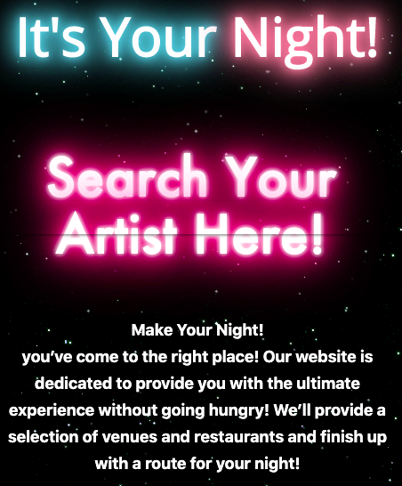
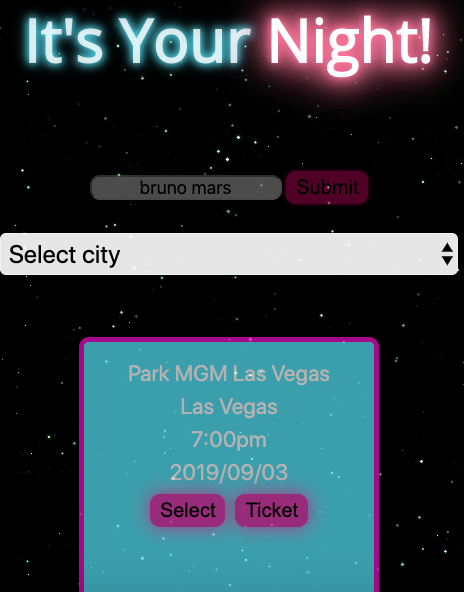
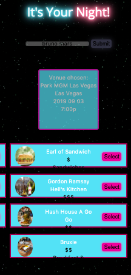
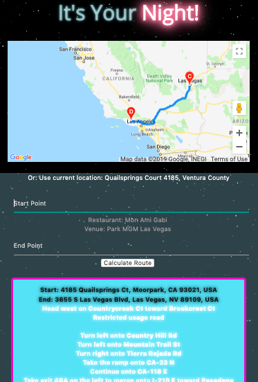

# its-your-night.github.io
It's Your Night is App for event planning. 

The app user is able to choose an artist, concert date

 

and then the app will display all the restaurants that are in the area.

Once user choose everything , map will display directions to the concert, restaurant as well as directions to return. 
Additionally user can choose different starting point on map as well.

Please check it out on https://itsyournight.herokuapp.com/

Coding Languages used:
 

